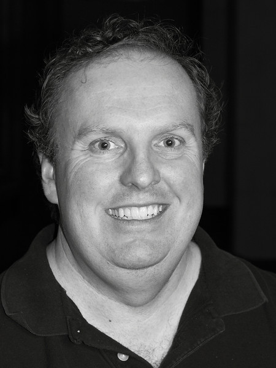

# Dr. Love

```{r Lovepic2-fig, echo = FALSE, out.width = '33%'}

```

Thomas E. Love, Ph.D.

- Professor of Medicine, Population and Quantitative Health Sciences, [CWRU](http://case.edu/)
- Director of [Biostatistics and Evaluation](http://chrp.org/biostatistics-evaluation/), [Center for Health Care Research & Policy](http://chrp.org/), [MetroHealth Medical Center](https://www.metrohealth.org/research)
- [Chief Data Scientist](http://www.betterhealthpartnership.org/data_center/), [Better Health Partnership](http://betterhealthpartnership.org/)
- Track Lead for Health Care Analytics, MS in Biostatistics, [Department of Population and Quantitative Health Sciences](http://epbiwww.case.edu/), CWRU
- Fellow, [American Statistical Association](http://www.amstat.org/)

## Email

- Email to get help with the course: **431-help at case dot edu** (seen by Professor Love and the TAs)
- Thomas dot Love at case dot edu (for matters related to grades or individual concerns)
- Dr. Love is hard to reach by phone. Email is always the best way to reach him.

## Offices

- Wood WG-82L on the ground floor of the Wood building (Tuesdays and Thursdays)
- Rammelkamp R-229A at MetroHealth Medical Center (Wednesdays and Fridays)

Dr. Love is generally available for a few minutes before and 30 minutes after class, otherwise by appointment on Tuesdays and Thursdays (send him an email to schedule an appointment.) 

## Web 

- [Web site for this course](https://github.com/thomaselove/432-2018)
- Dr. Love's GitHub name is [THOMASELOVE](https://github.com/thomaselove).
- His Twitter handle is @[ThomasELove](https://twitter.com/ThomasELove)

## A More Complete Biography

Hi. I have at least three different jobs.

- I am a Professor in the Departments of Medicine and Population & Quantitative Health Sciences at Case Western Reserve University. I teach three courses per year there (PQHS [431](https://github.com/THOMASELOVE/431), [432](https://github.com/THOMASELOVE/432-2018) and [500](https://github.com/THOMASELOVE/500-2018)) and also lead the Health Care Analytics track of the MS program in Biostatistics.
- I direct [Biostatistics and Evaluation](http://chrp.org/biostatistics-evaluation/) at the [Center for Health Care Research & Policy](http://chrp.org/), which is a joint venture of CWRU and MetroHealth Medical Center.
- For ten years, I was the (founding) Data Director for [Better Health Partnership](http://betterhealthpartnership.org/), an alliance of people who provide, pay for and receive care in Northeast Ohio. I now serve as Chief Data Scientist there.
- I am a Fellow of the American Statistical Association, and have won some awards for my teaching and my research. 
- I have been teaching at CWRU since 1994, and have taught every type of CWRU student over the years, especially graduate students in biostatistics, medicine, and management.

In research, I use statistical methods to look at questions in health policy and in particular the provision of health services. I mostly work with observational data, rather than data that emerge from randomized clinical trials, and I have a special interest in working with data from electronic health records.

- You may be interested in a [study in Health Affairs](http://content.healthaffairs.org/content/34/7/1121.abstract) showing the impact of a [Medicaid-like expansion plan on care and outcomes of poor patients in Cleveland](http://thedaily.case.edu/new-study-shows-prepared-safety-net-improves-care-saves-money-in-medicaid-expansion-population/).
- Or you might be interested in our [New England Journal of Medicine study](http://www.nejm.org/doi/full/10.1056/NEJMsa1102519) of the effect of electronic health records on the care and outcomes of people with diabetes.
- In 2011, [James O'Malley](http://tdi.dartmouth.edu/faculty/a-james-omalley-phd) and I chaired the [Ninth International Conference on Health Policy Statistics](https://ww2.amstat.org/meetings/ichps/2011/index.cfm?fuseaction=main), here in Cleveland. Here's a [recap](https://link.springer.com/article/10.1007%2Fs10742-012-0096-8). We may chair it again in 2021.
- I've also worked on many projects involving the use of propensity scores to make causal inferences from observational studies, particularly in heart failure.

If you want to see a [list of many of my publications](https://www.ncbi.nlm.nih.gov/myncbi/browse/collection/48415155/?sort=date&direction=ascending), knock yourself out. 

I hold degrees from Columbia University in the City of New York and from the University of Pennsylvania. My dissertation advisor was Paul Rosenbaum. I am married to a brilliant woman and we are raising two terrific sons, the elder of whom just finished his first semester of college. I live in Shaker Heights. In spare moments, I do community theater, and have appeared onstage with several local groups. Occasionally I sing in concerts with the Chagrin Valley Studio Orchestra, and I also play golf and try to lose weight.
